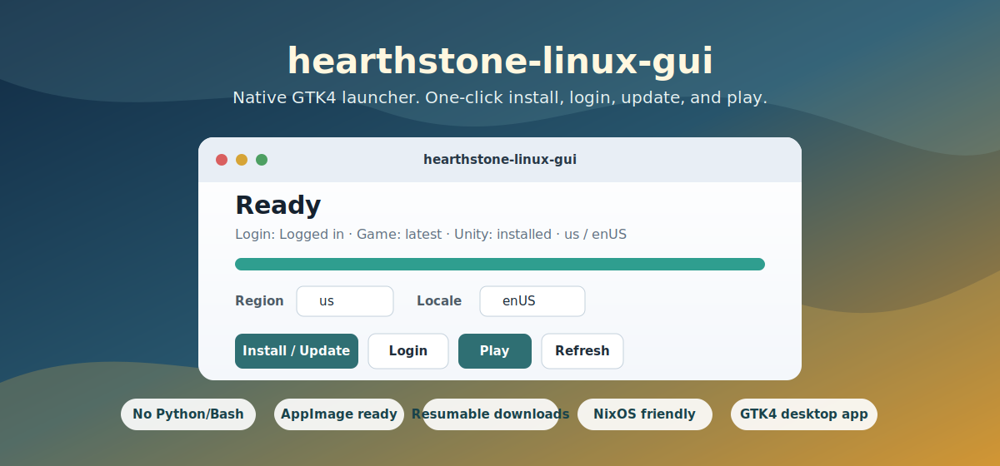
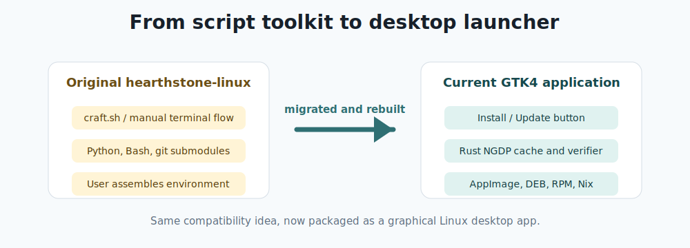
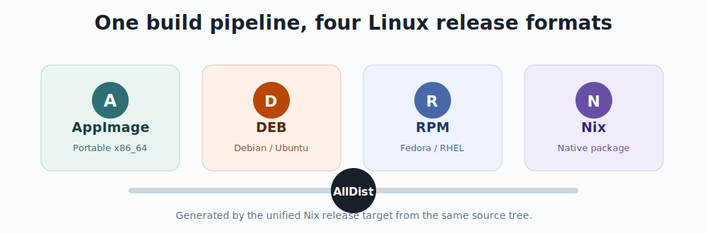

# hearthstone-linux-gui

<p align="center">
  
</p>

<p align="center">
  <a href="README.md">English README</a>
  ·
  <a href="https://github.com/DawnMagnet/hearthstone-linux-gui/releases/latest">最新发布版</a>
</p>

<p align="center">
  
  
  
  
</p>

**hearthstone-linux-gui** 是一个原生 GTK4 桌面管理器，用于在 Linux 上安装、更新、登录并启动炉石传说。本项目从原始
[`hearthstone-linux`](https://github.com/0xf4b1/hearthstone-linux)
项目迁移而来，但已经不再采用旧的脚本式使用方式，而是重构为一个可打包、可发布、可图形化使用的 Rust 桌面应用。

普通用户不需要任何命令行操作。下载安装包，用桌面环境打开，点击 **Install / Update**，点击 **Login**，最后点击 **Play** 即可。

## 从原项目迁移后的变化

原始 `hearthstone-linux` 证明了一个核心思路：炉石传说基于 Unity，官方游戏数据可以与 Unity Linux runtime
组合后在 Linux 上运行。本项目保留这个技术路线，但把使用方式升级为真正的桌面应用和标准发布包。

<p align="center">
  
</p>

| 原始 `hearthstone-linux` | 当前项目 |
| --- | --- |
| 以脚本和手工步骤为主 | GTK4/libadwaita 原生桌面应用 |
| 依赖命令行流程 | 安装、登录、更新、启动全部按钮化 |
| 用户侧需要准备 Python/Bash 等环境 | 发布包自带运行环境，普通使用无需 Python 或 Bash 环境 |
| 依赖外部 `keg` 下载流程 | Rust 原生 NGDP 下载器，支持缓存和校验 |
| 不同发行版准备成本较高 | 同时提供 AppImage、DEB、RPM 和 Nix 原生包 |

## 核心特性

- **一键桌面体验**：安装、更新、登录、启动都在 GTK4 窗口中完成。
- **无需命令行操作**：发布版本面向图形化安装和日常使用。
- **无需 Python/Bash 运行环境**：启动器是原生 Rust 程序，并随发布包携带所需运行库。
- **跨 Linux 发行版**：面向 NixOS、Debian、Ubuntu、Fedora 以及其他 x86_64 Linux 桌面系统。
- **AppImage 便携包**：适合在尽可能多的 Linux 环境中直接运行。
- **Nix 原生包**：Nix/NixOS 用户可以获得标准 Nix 包、桌面文件和启动器。
- **DEB/RPM 安装包**：适合通过发行版的软件中心或包管理器安装。
- **断点续传**：Unity runtime 下载中断后可以从未完成的部分继续。
- **缓存复用**：NGDP 游戏数据会被缓存并校验，减少重复下载。
- **不依赖 Steam**：AppImage 自带可移植 GTK/runtime 层，游戏启动由项目自身 runtime 处理，不需要 `steam-run`。

## 发布包选择

<p align="center">
  
</p>

| 包格式 | 适合场景 | 用户体验 |
| --- | --- | --- |
| **AppImage** | 任意 x86_64 Linux 桌面环境，包括 NixOS | 下载后直接打开应用 |
| **DEB** | Debian、Ubuntu、Linux Mint、Pop!_OS 等系统 | 双击后通过图形化软件中心安装 |
| **RPM** | Fedora、RHEL 兼容系统以及 openSUSE 类工作流 | 双击后通过图形化软件中心安装 |
| **Nix** | NixOS 和 Nix 用户 | 原生 Nix 包输出，包含桌面文件和启动器 |

所有发布产物都来自统一的 Nix 构建流程，确保 AppImage、DEB、RPM 和 Nix 包使用同一份源码、同一个版本和同一套依赖图。

## 普通用户如何安装

1. 打开
   [最新发布页面](https://github.com/DawnMagnet/hearthstone-linux-gui/releases/latest)。
2. 下载适合自己系统的安装包。
3. 用桌面环境打开：
   - AppImage：直接打开下载好的 AppImage。如果文件管理器提示权限问题，在文件属性里勾选“允许作为程序执行”。
   - DEB/RPM：双击安装包，用图形化软件中心安装。
   - Nix/NixOS：通过你平时使用的 Nix 图形化或系统配置流程安装原生 Nix 包。
4. 从应用菜单启动 **hearthstone-linux-gui**。

应用打开后的正常流程是：

1. 选择 **Region** 和 **Locale**。
2. 点击 **Install / Update**。
3. 点击 **Login**，在浏览器里完成 Battle.net 登录。
4. 回到应用，点击 **Play**。

应用会把用户数据存放在标准 XDG 目录下。Unity runtime 下载中断后会自动断点续传，已经下载过的游戏数据会尽可能复用。

## Nix、NixOS 和 Home Manager

本仓库本身就是一个面向 `x86_64-linux` 的 flake。目前它暴露的是 package、app 和开发 shell 输出；暂时没有单独的
NixOS module 或 Home Manager module。因此在 NixOS / Home Manager 中使用时，直接把 package 输出加入系统或用户包列表即可。

从 GitHub 直接运行：

```sh
nix run github:DawnMagnet/hearthstone-linux-gui
```

在本地仓库构建：

```sh
nix build .#default
nix build .#AppImage
nix build .#runtime
```

当前可用的 flake 输出：

| 输出 | 用途 |
| --- | --- |
| `packages.x86_64-linux.default` | GTK 启动器的原生 Nix 包 |
| `packages.x86_64-linux.runtime` | 用于启动下载后的 Unity player 的 FHS runtime wrapper |
| `packages.x86_64-linux.AppImage` | 便携 AppImage 构建产物 |
| `packages.x86_64-linux.AppDir` | 构建 AppImage 时使用的中间 AppDir |
| `apps.x86_64-linux.default` | `nix run` 入口 |
| `devShells.x86_64-linux.default` | Rust/GTK 开发 shell |

在 NixOS flake 中，可以把仓库加入 `inputs`，然后通过 `environment.systemPackages` 安装：

```nix
{
  inputs = {
    nixpkgs.url = "github:NixOS/nixpkgs/nixos-unstable";
    hearthstone-linux-gui.url = "github:DawnMagnet/hearthstone-linux-gui";
  };

  outputs = { nixpkgs, hearthstone-linux-gui, ... }: {
    nixosConfigurations.my-host = nixpkgs.lib.nixosSystem {
      system = "x86_64-linux";
      modules = [
        ({ pkgs, ... }: {
          environment.systemPackages = [
            hearthstone-linux-gui.packages.${pkgs.stdenv.hostPlatform.system}.default
          ];
        })
      ];
    };
  };
}
```

在独立 Home Manager flake 中，可以加入 `home.packages`：

```nix
{
  inputs = {
    nixpkgs.url = "github:NixOS/nixpkgs/nixos-unstable";
    home-manager.url = "github:nix-community/home-manager";
    hearthstone-linux-gui.url = "github:DawnMagnet/hearthstone-linux-gui";
  };

  outputs = { nixpkgs, home-manager, hearthstone-linux-gui, ... }:
    let
      system = "x86_64-linux";
      pkgs = nixpkgs.legacyPackages.${system};
    in
    {
      homeConfigurations.my-user = home-manager.lib.homeManagerConfiguration {
        inherit pkgs;
        modules = [
          {
            home.username = "my-user";
            home.homeDirectory = "/home/my-user";
            home.stateVersion = "25.05";
            home.packages = [
              hearthstone-linux-gui.packages.${system}.default
            ];
          }
        ];
      };
    };
}
```

如果你是在 NixOS module 里使用 Home Manager，把同一个 package 表达式放进
`home-manager.users.<name>.home.packages` 即可。

## 工作原理

炉石传说通过暴雪的 NGDP 分发系统提供官方游戏数据。游戏本身基于 Unity；在整理平台文件布局后，可以使用 Unity
Linux player 运行这些官方游戏数据。

本启动器会自动完成这些步骤：

1. 根据选择的区服和语言下载官方炉石传说游戏数据。
2. 校验并缓存下载内容。
3. 将 macOS 风格的文件布局转换为 Linux 可运行布局。
4. 检测游戏需要的 Unity 版本，并安装对应的 Linux Unity player。
5. 安装兼容文件和游戏配置。
6. 注册登录回调处理器，并在本地保存加密后的登录 token。
7. 通过受控的 Linux runtime 环境启动游戏。

本仓库和发布包不包含任何炉石传说专有游戏文件。安装过程中，应用会从官方上游分发端点获取所需文件。

## 状态与限制

- 当前目标架构：**x86_64 Linux**。
- 游戏客户端可以运行，但本项目是非官方项目。
- 游戏内商店可能会因为上游行为保持不可用。
- 请自行承担使用风险。本项目与 Blizzard Entertainment 没有关联，也未获得其认可。

## 常见问题

| 现象 | 建议 |
| --- | --- |
| 应用显示 **Login Required** | 再次点击 **Login** 并完成浏览器登录流程。 |
| 安装过程中断 | 重新点击 **Install / Update**，断点续传和缓存会继续发挥作用。 |
| 更新后游戏无法启动 | 点击一次 **Install / Update**，修复 Unity/runtime 文件。 |
| 某些发行版上安装包打开后不能启动 | 优先尝试 AppImage，它携带的运行环境最完整。 |

发布版本默认只输出 INFO 级别及以上日志。开发者本地排障时，可以使用标准 `RUST_LOG` 环境变量开启更详细日志。

## 法律说明

Hearthstone / 炉石传说、Battle.net、Blizzard Entertainment 及相关名称、商标、游戏资产、服务和其他材料，均归
Blizzard Entertainment, Inc. 或其关联方、许可方所有。

本项目是非官方兼容启动器，不由 Blizzard Entertainment、Battle.net、Microsoft、Activision Blizzard 或其任何关联方制作、发布、赞助、批准、认可、维护或支持。本仓库和启动器发布包不保存或分发任何炉石传说专有游戏资产。

完整法律信息、项目边界、用户责任和权利人请求流程见 [LEGAL.md](LEGAL.md)。
